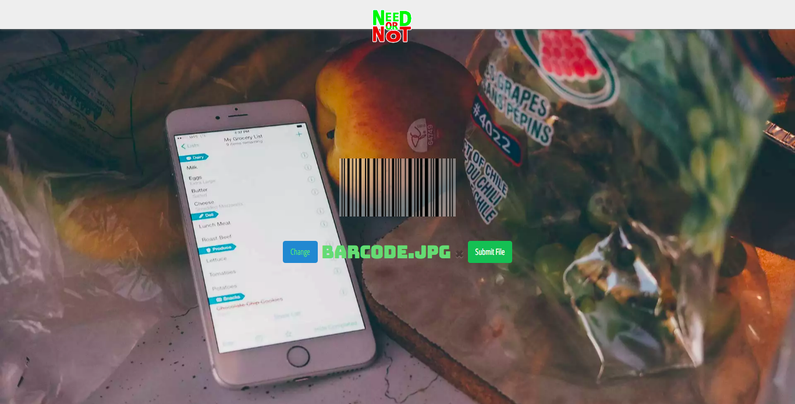
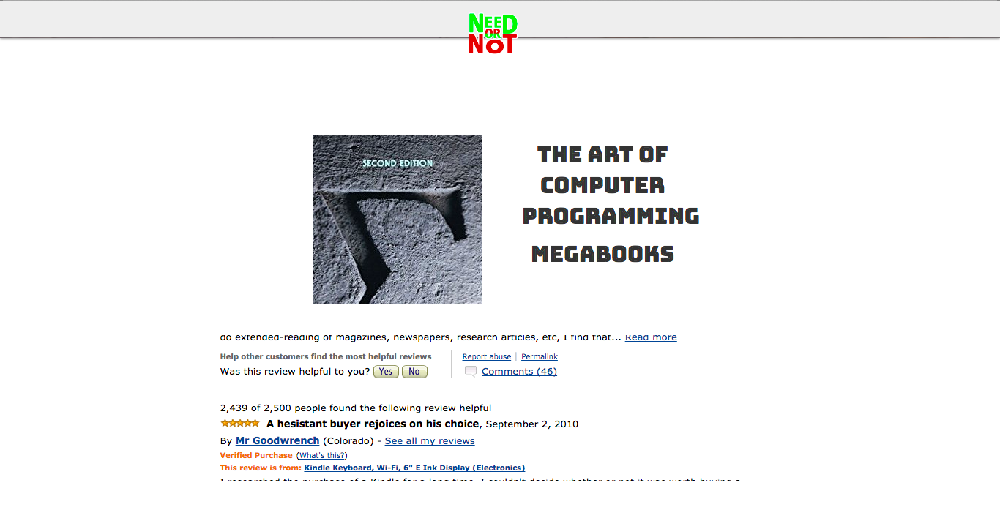
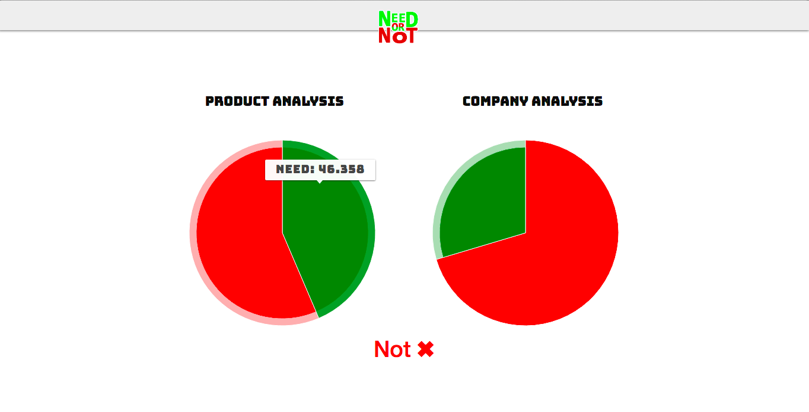

# need-or-not
A web application that helps you choose products you need vs products you don't *(not)*. Our main-page will select a picture of a barcode from your computer or allow you take a photo of one from your phone.

You can see the some reviews from amazon and the product itself

Using semantic analysis tool indico, an api that computes semantic analysis we display the overall necessity of the product based on consumer reviews and review on the company

More info on the project at [devpost](https://devpost.com/software/needornot-i4a29x)  
